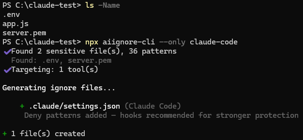
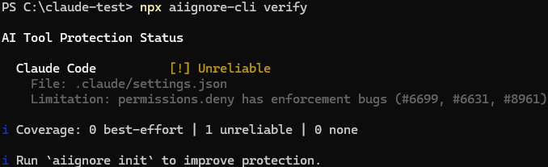

# aiignore

One command to protect your secrets from all AI coding tools.

Every AI tool has a different ignore mechanism — `.cursorignore`, `.geminiignore`, `.codeiumignore`, `.aiderignore`, `.claude/settings.json`, `.aiignore` — each with its own quirks and undocumented bypass bugs. `aiignore` scans your project, detects which tools you use, and generates the right config for each one.

## Quick Start

```bash
npx aiignore-cli init
```

Or install globally:

```bash
npm install -g aiignore-cli
aiignore init
```

Requires Node.js 18+.

## Why not just create the files manually?

You could. A `.cursorignore` takes 30 seconds to write. But:

- Do you know that Cursor also needs `.cursorignore`, Claude Code needs `settings.json` deny rules, Gemini CLI needs `.geminiignore`, JetBrains needs `.aiignore`, and Windsurf still uses `.codeiumignore`?
- Do you know that Cursor's ignore is "best-effort" with 2 known CVEs, that Gemini's negation patterns are broken, or that Copilot has no ignore file at all?
- Do you want to research each tool's format every time you set up a new project?

`aiignore` does the research for you. The security data behind each tool is the real value — the CLI just applies it.

## Commands

### `aiignore init`



### `aiignore verify`



```bash
aiignore                             # same as aiignore init
aiignore init                        # auto-detect and generate
aiignore init --all                  # all tools, skip detection
aiignore init --only cursor          # single tool
aiignore init --only cursor,gemini   # multiple tools (comma-separated)
aiignore init --append               # add missing patterns to existing files
aiignore init --dry-run              # preview only
aiignore init --force                # overwrite existing files
aiignore init -q                     # quiet mode (no output)

aiignore verify                      # protection status table
aiignore verify --ci                 # exit 1 if unprotected
aiignore verify --strict             # exit 1 if any tool isn't best-effort
aiignore verify --json               # machine-readable output

aiignore list                        # show supported tools and aliases
```

## Tool Support

| Tool | File Generated | Reliability | Key Issue |
|------|---------------|-------------|-----------|
| Cursor | `.cursorignore` | Low | "best-effort", agent bypass, `@` reference bypass |
| Claude Code | `.claude/settings.json` | Medium | `Read()` deny covers Bash too (tested) |
| Copilot | guide only | None | no ignore file exists for individual devs |
| Gemini CLI | `.geminiignore` | Low | negation patterns broken, self-blocks `.env`/`.pem` |
| JetBrains AI | `.aiignore` | High | most reliable; AI redacts sensitive filenames |
| Windsurf | `.codeiumignore` | Medium | negation can't override `.gitignore` |
| Aider | `.aiderignore` | Medium | `--aiderignore` flag or `/add` can bypass |

## What Gets Protected

Patterns are sourced from built-in defaults + security-related entries in your `.gitignore`:

| Category | Patterns |
|----------|----------|
| Environment | `.env`, `.env.*`, `.env.local` |
| Credentials | `credentials.json`, `service-account*.json`, `*secret*`, `token.json` |
| Keys | `*.pem`, `*.key`, `*.p12`, `*.pfx`, `*.jks`, `*.gpg`, `*.asc` |
| SSH | `.ssh/`, `id_rsa*`, `id_ed25519*`, `id_ecdsa*` |
| Cloud | `.aws/`, `.gcp/`, `.azure/`, `gcloud/` |
| Infrastructure | `terraform.tfstate`, `terraform.tfvars`, `.docker/config.json`, `.kube/config` |
| Registry & Auth | `.npmrc`, `.pypirc`, `.netrc`, `*.htpasswd` |
| App Secrets | `config/secrets.yml`, `config/master.key`, `vault.json`, `wp-config.php` |
| Database | `*.sqlite`, `*.db`, `dump.sql` |
| Certificates | `*.crt`, `*.cer`, `*.ca-bundle` |

## Tool Aliases

`--only` accepts these names (comma-separated):

```
cursor                     -> Cursor
claude / claude-code       -> Claude Code
copilot                    -> GitHub Copilot
gemini / gemini-cli        -> Gemini CLI
jetbrains / jb             -> JetBrains AI
windsurf / codeium         -> Windsurf/Codeium
aider                      -> Aider
```

Run `aiignore list` to see all tools and aliases.

## Project Configuration (`.aiignorerc`)

Create a `.aiignorerc` file in your project root to customize behavior:

```json
{
  "tools": ["cursor", "claude", "jetbrains"],
  "extraPatterns": ["internal/", "*.staging.env"]
}
```

- **`tools`**: Lock target tools instead of auto-detection. Accepts the same aliases as `--only`.
- **`extraPatterns`**: Additional patterns merged into every generated ignore file.

Both fields are optional. `--all` and `--only` flags override the `tools` config.

## Limitations

No AI tool guarantees 100% file exclusion. All tools share a common weakness: agent/terminal modes can bypass ignore files by running shell commands directly. Copilot has no ignore mechanism at all for individual developers.

This tool is one layer of defense. For production secrets, also use a secrets manager, pre-commit hooks (`gitleaks`, `trufflehog`), and keep secrets out of your project directory entirely.

For per-tool details (CVEs, known bugs, tested behavior), see [AI Coding Tool Security Reference](docs/test-report.md).

## License

Apache-2.0
