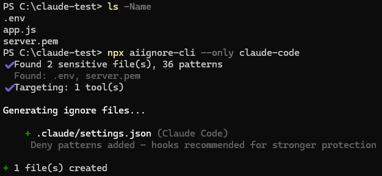
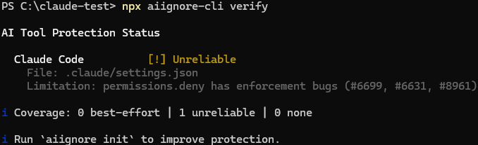

# aiignore

One command to protect your secrets from all AI coding tools.

Every AI tool has a different ignore mechanism — `.cursorignore`, `.geminiignore`, `.codeiumignore`, `.aiderignore`, `.clineignore`, `.rooignore`, `.claude/settings.json`, `.aiignore` — each with its own quirks and undocumented bypass bugs. `aiignore` scans your project, detects which tools you use, and generates the right config for each one.

## Quick Start

```bash
npx aiignore-cli init
```

Or install globally:

```bash
npm install -g aiignore-cli
aiignore init
```

Requires Node.js 18+.

## Why not just create the files manually?

You could. A `.cursorignore` takes 30 seconds to write. But:

- Do you know that Cursor also needs `.cursorignore`, Claude Code needs `settings.json` deny rules, Gemini CLI needs `.geminiignore`, JetBrains needs `.aiignore`, and Windsurf still uses `.codeiumignore`?
- Do you know that Cursor doesn't guarantee complete protection and can't block terminal/MCP access (its 2 known CVEs were fixed in 1.7/2.0), that Gemini's negation patterns are broken, or that Copilot has no ignore file at all?
- Do you want to research each tool's format every time you set up a new project?

`aiignore` does the research for you. The security data behind each tool is the real value — the CLI just applies it.

## Commands

### `aiignore init`



### `aiignore verify`



```bash
aiignore                             # same as aiignore init
aiignore init                        # auto-detect and generate
aiignore init --all                  # all tools, skip detection
aiignore init --only cursor          # single tool
aiignore init --only cursor,gemini   # multiple tools (comma-separated)
aiignore init --append               # add missing patterns to existing files
aiignore init --dry-run              # preview only
aiignore init --force                # overwrite existing files
aiignore init -q                     # quiet mode (no output)

aiignore verify                      # protection status table
aiignore verify --ci                 # exit 1 if a protectable tool has no ignore file
aiignore verify --strict             # exit 1 if any tool is unprotected or missing a critical pattern
aiignore verify --json               # machine-readable output

aiignore list                        # show supported tools and aliases

aiignore config                      # show effective configuration
aiignore config path                 # print global config file path
```

## Tool Support

| Tool | File Generated | Reliability | Key Issue |
|------|---------------|-------------|-----------|
| Cursor | `.cursorignore` | Low | not guaranteed; terminal/MCP not blocked (CVEs fixed in 1.7/2.0) |
| Claude Code | `.claude/settings.json` | Medium | `Read()` deny covers Bash too, but not arbitrary subprocesses |
| Copilot | guide only | None | no ignore file exists for individual devs |
| Gemini CLI | `.geminiignore` | Low | negation patterns broken, self-blocks `.env`/`.pem` |
| JetBrains AI | `.aiignore` | High | most reliable; AI redacts sensitive filenames |
| Windsurf | `.codeiumignore` | Medium | negation can't override `.gitignore` |
| Aider | `.aiderignore` | Medium | `--aiderignore` flag or `/add` can bypass |
| Cline | `.clineignore` | Medium | controls context loading, not terminal execution |
| Roo Code | `.rooignore` | Medium | terminal commands may bypass restrictions |

## What Gets Protected

Patterns are sourced from built-in defaults + security-related entries in your `.gitignore`:

| Category | Patterns |
|----------|----------|
| Environment | `.env`, `.env.*`, `.env.local` |
| Credentials | `credentials.json`, `service-account*.json`, `serviceAccount*.json`, `.git-credentials`, `*secret*`, `token.json` |
| Keys | `*.pem`, `*.key`, `*.p12`, `*.pfx`, `*.jks`, `*.gpg`, `*.asc` |
| SSH | `.ssh/`, `id_rsa*`, `id_ed25519*`, `id_ecdsa*`, `id_dsa*`, `*.ppk` |
| Cloud | `.aws/`, `.gcp/`, `.azure/`, `gcloud/` |
| Infrastructure | `*.tfstate`, `*.tfstate.backup`, `.terraform/`, `.docker/config.json`, `.kube/config` |
| Registry & Auth | `.npmrc`, `.pypirc`, `.netrc`, `.pgpass`, `.my.cnf`, `.s3cfg`, `*.htpasswd` |
| App Secrets | `config/secrets.yml`, `config/master.key`, `vault.json`, `.dev.vars`, `local.settings.json`, `wp-config.php` |
| MCP & AI Config | `mcp.json`, `.mcp.json`, `.cursor/mcp.json`, `.aider.conf.yml`, `.aider.chat.history.md` |
| Database | `*.sqlite`, `*.db`, `dump.sql` |
| Certificates | `*.crt`, `*.cer`, `*.ca-bundle` |

## Tool Aliases

`--only` accepts these names (comma-separated):

```
cursor                     -> Cursor
claude / claude-code       -> Claude Code
copilot                    -> GitHub Copilot
gemini / gemini-cli        -> Gemini CLI
jetbrains / jb             -> JetBrains AI
windsurf / codeium         -> Windsurf/Codeium
aider                      -> Aider
cline                      -> Cline
roo / roo-code             -> Roo Code
```

Run `aiignore list` to see all tools and aliases.

## Project Configuration (`.aiignorerc`)

Create a `.aiignorerc` file in your project root to customize behavior:

```json
{
  "tools": ["cursor", "claude", "jetbrains"],
  "extraPatterns": ["internal/", "*.staging.env"]
}
```

- **`tools`**: Lock target tools instead of auto-detection. Accepts the same aliases as `--only`.
- **`extraPatterns`**: Additional patterns merged into every generated ignore file.

Both fields are optional. `--all` and `--only` flags override the `tools` config.

## Global Configuration

Create `~/.config/aiignore/config.json` to apply personal patterns across all projects:

```json
{
  "extraPatterns": ["company-internal/", "*.corp-secret"]
}
```

Global `extraPatterns` are merged with project-level patterns. Project-level `tools` override global `tools`. Run `aiignore config` to see the effective configuration.

## Limitations

**What this tool does — and does not — protect.** `aiignore` reduces what AI coding tools *read into their context*. It does **not** stop secrets that are already committed to git from leaking (that's the job of `.gitignore`, push protection, and scanners like `gitleaks`), and it does **not** fully stop an autonomous agent's shell from bypassing the ignore file (that's the job of a sandbox). Treat it as the first layer, not the boundary.

No AI tool guarantees 100% file exclusion. All tools share a common weakness: agent/terminal modes can bypass ignore files by running shell commands directly. Copilot has no ignore mechanism at all for individual developers.

This tool is one layer of defense. For production secrets, also use a secrets manager, pre-commit hooks (`gitleaks`, `trufflehog`), and keep secrets out of your project directory entirely.

For per-tool details (CVEs, known bugs, tested behavior), see [AI Coding Tool Security Reference](docs/test-report.md).

## License

Apache-2.0
